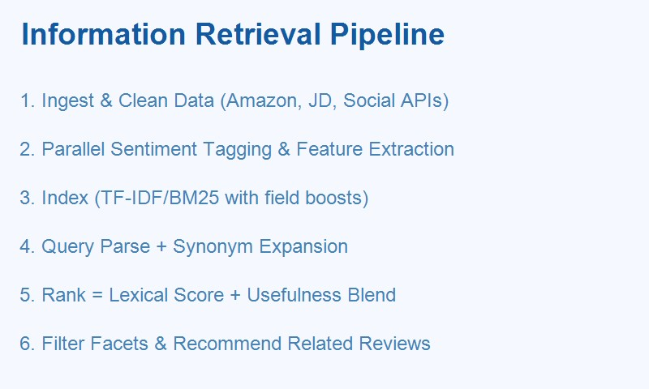

## Product Review Sentiment Filter & Recommendation System



[](https://github.com/your-username/your-repo/stargazers)
[](https://github.com/your-username/your-repo/network/members)
[](LICENSE)
[](#)

### Introduction
This project focuses on the Information Retrieval (IR) core of a review assistant. We use course‑level IR techniques to let users issue attribute‑style queries (e.g., “battery life”, “sound quality”) and retrieve the most relevant reviews. The emphasis is on indexing, query processing, matching, ranking, filtering, and simple evaluation with TF‑IDF/BM25 and cosine similarity.

中文简介：本项目聚焦信息检索基础，实现“索引、查询、匹配、排序、过滤、评测”的清晰管线，用课程级方法（TF‑IDF/BM25）支持属性关键词检索如“续航/音质”，返回最相关的评论。

### Scope and Features (IR-Focused)
- **Indexing**: Build TF‑IDF or BM25 indices on review text; optional field boosts for `product_title/brand`.
- **Query processing**: Tokenization, normalization, stop‑word removal, simple synonym/alias expansion.
- **Matching**: Vector space matching (cosine similarity) or BM25 scoring.
- **Ranking**: Fuse lexical relevance with simple usefulness priors (likes, word count).
- **Filtering**: Optional sentiment/usefulness thresholds.
- **Evaluation**: Precision@k on a small labeled query set（可选）.

### IR Design Details (Course Fundamentals)
- **Document Representation**
  - Vocabulary on `review_text`（可选加入 `product_title/brand` 设定字段权重）
  - Weighting: TF‑IDF（log‑tf + idf 平滑）或 BM25（k1、b 参数）
- **Indexing**
  - TF‑IDF 用 scikit‑learn 构建稀疏矩阵；BM25 可用 rank‑bm25
  - 保存文档长度与元数据（likes、has_image、created_at）
- **Query Processing**
  - 归一化（小写、去标点）、停用词、分词（英文/中文）
  - 同义词表：battery life↔续航，sound quality↔音质/声质
- **Retrieval and Matching**
  - TF‑IDF + 余弦相似 或 BM25 进行 top‑k 候选检索
  - 可选伪相关反馈（PRF）扩展查询词
- **Ranking（与有用性融合）**
  - FinalScore = λ·LexicalScore + (1−λ)·Usefulness（0≤λ≤1）
  - Usefulness 由 log(1+likes)、has_image、word_count 线性组合并归一
- **Filtering**
  - 可按情感/有用性阈值过滤：`min_words`、`min_likes`、`has_image`
- **Evaluation（可选）**
  - Precision@k/Recall@k；对比 TF‑IDF vs BM25、不同 λ/阈值

High‑level flow: Index → Query → Retrieve → Rank → Filter

### Information Retrieval Details
- **Indexing**
  - Tokenization: English uses word tokenizers; Chinese uses word segmentation (e.g., jieba) to support CJK terms like “续航/音质”.
  - Representation: TF‑IDF vectors (scikit‑learn) or BM25 (via rank‑bm25) built over `review_text` and optionally `product_title/brand`.
  - Field boosts: `title: 1.5`, `brand: 1.2`, `review_text: 1.0` (tunable).
- **Query Processing**
  - Language detection → pick tokenizer.
  - Normalization: lowercasing, stop‑word removal, punctuation stripping.
  - Synonyms/aliases: lightweight dictionary (e.g., “battery life” ↔ “续航”, “sound quality” ↔ “音质/声质”).
  - Optional query expansion: add top‑k terms from pseudo‑relevance feedback.
- **Filtering**
  - Sentiment facet: keep `positive/negative` or both; drop `neutral` by default.
  - Usefulness thresholds: `min_words`, `min_likes`, `has_image` flag.
  - Time window: filter by `created_at` to prioritize recency.
- **Ranking**
  - Base lexical score: cosine similarity (TF‑IDF) or BM25 score.
  - Usefulness score: e.g., `alpha*log1p(likes) + beta*has_image + gamma*word_norm`.
  - Final score: `lambda*lexical + (1-lambda)*usefulness` (all coefficients tunable via CLI).
- **Recommendation (Query‑Aligned)**
  - For a user query (e.g., “laptop battery”), retrieve top results from other brands’ products using the same index, then re‑rank by usefulness and diversity (MMR).
- **Evaluation (optional)**
  - Offline: precision@k/recall@k for a set of labeled queries.
  - Online: click‑through on recommended reviews; dwell time as proxy.

### Installation & Quick Start
1. Clone the repository
```bash
git clone https://github.com/your-username/your-repo.git
cd your-repo
```

2. Create environment (optional but recommended)
```bash
python -m venv .venv
source .venv/bin/activate   # Windows: .venv\\Scripts\\activate
```

3. Install dependencies
```bash
pip install -r requirements.txt
python -c "import nltk; nltk.download('vader_lexicon')"  # if using VADER
```

4. Prepare datasets (see “Datasets” below) and place CSVs under `data/`

5. Run: simple IR retrieval
```bash
python main.py \
  --input data/amazon_small_reviews.csv \
  --query "laptop battery life" \
  --retriever tfidf --topk 10 \
  --rank_lambda 0.8 --min_words 20 --min_likes 5
```

### Usage Examples
- **CLI: plain search (TF‑IDF)**
```bash
python main.py --input data/reviews.csv --query "sound quality" --retriever tfidf --topk 10
```

- **CLI: BM25 + usefulness fusion**
```bash
python main.py \
  --input data/amazon_small_reviews.csv \
  --query "battery life" \
  --retriever bm25 --topk 10 \
  --rank_lambda 0.7 --min_likes 5 --min_words 20
```

- **Python API (IR‑only stub)**
```python
from pipeline import ReviewPipeline

pipe = ReviewPipeline(
    retriever="tfidf",  # or "bm25"
    rank_lambda=0.8,
)

df = pipe.load_csv("data/reviews.csv")
df = pipe.build_index(df, fields=("review_text","product_title","brand"))
results = pipe.search(query="battery life", topk=10, min_words=20, min_likes=5)
pipe.save(results, path="results.json")
```

### Datasets
- **Amazon Product Reviews (Small)** on Kaggle: includes >5k reviews with ratings, text, and helpfulness signals. Download via Kaggle: [Kaggle – Amazon Product Reviews (Small)](https://www.kaggle.com/).
- **JD/JD.com (京东) samples**: Publicly visible product review pages provide text, ratings, likes, and images; scrape only where permitted and cache to CSV with fields listed below.
- **Taobao/Tmall public product pages**: Public facing review snippets can be used similarly where allowed; ensure compliance with site policies and local laws.
- Place final CSVs under `data/`; one file per product category is recommended for clean indexing.

Expected CSV schema (minimal):
```text
review_id,product_id,product_title,brand,language,rating,review_text,likes,has_image,created_at
```

#### Social Media Sources (access evidence)
- **Reddit**: 官方 API（PRAW 等库可用），文档 `https://developers.reddit.com/`
- **Twitter/X**: 开发者平台 `https://developer.twitter.com/`（配额与权限依平台政策）
- **Weibo**: 公开页可视但受登录/反爬约束，需合规并节流
研究/教学用途请遵守 robots.txt、平台条款与当地法规，优先 API。

### What’s Innovative Here
- 用课程级 IR 方法（TF‑IDF/BM25、余弦相似度）构建真实可用的检索排序，并与“有用性”先验融合，形成可解释、可调参的轻量系统。

### Contributing
Contributions are welcome! Please open an issue to discuss ideas or submit a PR for:
- New feature extractors (e.g., verified‑purchase, reviewer reputation)
- Additional languages/lexicons
- Better ranking functions or evaluation scripts

### License & Contact
This project is released under the MIT License. See `LICENSE` for details.

Author: nikk909 (yinghua253659@163.com)

### TODO / Future Work
- 提供 `docs/ir-config.md`（默认参数、字段权重与调参建议）
- 增加标注查询集与评测脚本（precision@k、MAP）
- Web API/前端 Demo（FastAPI + 简易 UI）

---

Keywords: information retrieval, TF‑IDF, BM25, cosine similarity, ranking, filtering, product reviews, keyword search, evaluation, precision@k, e‑commerce reviews


